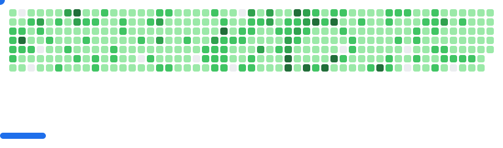

Hi!

I am Cees-Jan Kiewiet.

All new major package releases will be in PHP 8.3, and most most minor updates will also be raised to 8.3 when doing update rounds. In specific situations a final release for the previous PHP version will be made before bumping to 8.3 in the next right after.

---

#### 💻 Check out what I'm currently working on

- [jakubkulhan/bunny](https://github.com/jakubkulhan/bunny) (1 day ago)
- [WyriHaximus/github-workflows](https://github.com/WyriHaximus/github-workflows) (1 day ago)
- [WyriHaximusNet/docker-php](https://github.com/WyriHaximusNet/docker-php) (1 day ago)
- [reactphp-parallel/streams](https://github.com/reactphp-parallel/streams) (2 days ago)
- [WyriHaximus/Makefiles](https://github.com/WyriHaximus/Makefiles) (2 days ago)
- [reactphp-parallel/event-loop](https://github.com/reactphp-parallel/event-loop) (2 days ago)
- [reactphp-parallel/runtime](https://github.com/reactphp-parallel/runtime) (2 days ago)
- [WyriHaximus/php-coding-standard](https://github.com/WyriHaximus/php-coding-standard) (3 days ago)
- [WyriHaximus/php-css-compress](https://github.com/WyriHaximus/php-css-compress) (3 days ago)
- [WyriHaximus/php-metrics-tactician](https://github.com/WyriHaximus/php-metrics-tactician) (3 days ago)
- [WyriHaximus/php-async-test-utilities](https://github.com/WyriHaximus/php-async-test-utilities) (3 days ago)
- [reactphp-parallel/pool-tests](https://github.com/reactphp-parallel/pool-tests) (3 days ago)
- [WyriHaximus/php-tile-stitcher](https://github.com/WyriHaximus/php-tile-stitcher) (3 days ago)

---

### 📜 My latest articles on [WyriHaximus.net](https://blog.wyrihaximus.net/)

- [ReactPHP Parallel v2(.1)](https://blog.wyrihaximus.net/2025/06/reactphp-parallel-v2-/) (3 months ago)
- [Announcing TestInfra Action](https://blog.wyrihaximus.net/2025/03/announcing-testinfra-action/) (5 months ago)
- [Building a kubernetes homelab with Raspberry Pi and Lego: Nodes: Enclosure](https://blog.wyrihaximus.net/2024/12/building-a-kubernetes-homelab-with-raspberry-pies-and-lego-nodes-enclosure/) (9 months ago)
- [Building Secure Images with GitHub Actions](https://blog.wyrihaximus.net/2024/10/building-secure-images-with-github-actions/) (11 months ago)
- [Building a kubernetes homelab with Raspberry Pi and Lego: Nodes: Power](https://blog.wyrihaximus.net/2024/09/building-a-kubernetes-homelab-with-raspberry-pies-and-lego-nodes-power/) (1 year ago)
- [Building a kubernetes homelab with Raspberry Pi and Lego: Nodes: Storage](https://blog.wyrihaximus.net/2024/08/building-a-kubernetes-homelab-with-raspberry-pies-and-lego-nodes-storage/) (1 year ago)
- [Building a kubernetes homelab with Raspberry Pi and Lego: Network: Switch](https://blog.wyrihaximus.net/2024/07/building-a-kubernetes-homelab-with-raspberry-pies-and-lego-network-switch/) (1 year ago)
- [Updating (PHP) packages to ReactPHP Promise v3, and test your types with PHPStan](https://blog.wyrihaximus.net/2024/06/updating-php-packages-to-reactphp-promise-v3--and-test-your-types-with-phpstan/) (1 year ago)
- [Always recreating a TerraForm resource](https://blog.wyrihaximus.net/2024/04/always-recreating-a-terraform-resource/) (1 year ago)
- [Building fast Docker based GitHub Actions](https://blog.wyrihaximus.net/2023/03/building-fast-docker-based-github-actions/) (2 years ago)

---

<picture>
  <source
    media="(prefers-color-scheme: dark)"
    srcset="images/breakout-dark.svg"
  />
  <source
    media="(prefers-color-scheme: light)"
    srcset="images/breakout-light.svg"
  />
  
</picture>

---

#### 🌱 My latest projects

- [WyriHaximus/renovate-runner](https://github.com/WyriHaximus/renovate-runner) - renovate-runner
- [WyriHaximus/hass-entity-to-prometheus-push-gateway](https://github.com/WyriHaximus/hass-entity-to-prometheus-push-gateway) - 
- [WyriHaximus/github-action-testinfra](https://github.com/WyriHaximus/github-action-testinfra) - GitHub Action running your TestInfra tests
- [WyriHaximus/github-action-oci-image-supported-platforms](https://github.com/WyriHaximus/github-action-oci-image-supported-platforms) - 
- [WyriHaximus/hacs-prometheus-pushgateway](https://github.com/WyriHaximus/hacs-prometheus-pushgateway) - Home Assistant addon that pushes entity state changes to a Prometheus PushGateway
- [WyriHaximus/php-generative-composer-plugin-tooling](https://github.com/WyriHaximus/php-generative-composer-plugin-tooling) - Tooling for creating generative Composer Plugins
- [WyriHaximus/Makefiles](https://github.com/WyriHaximus/Makefiles) - Makefile building blocks
- [WyriHaximus/playground-github-action-mixed-js-docker](https://github.com/WyriHaximus/playground-github-action-mixed-js-docker) - Playground to work on shared workflows
- [WyriHaximus/php-tile-stitcher](https://github.com/WyriHaximus/php-tile-stitcher) - 
- [WyriHaximus/reactphp-phpunit-run-tests-in-fiber](https://github.com/WyriHaximus/reactphp-phpunit-run-tests-in-fiber) - Trait to run all tests in a fiber
- [WyriHaximus/php-metrics-prometheus-push-gateway](https://github.com/WyriHaximus/php-metrics-prometheus-push-gateway) - Prom Push Gateway package for wyrihaximus/metrics
- [WyriHaximus/phpstan-reactphp](https://github.com/WyriHaximus/phpstan-reactphp) - ReactPHP extension for PHPStan
- [WyriHaximus/reactphp-throw-unhandled-rejected-promises](https://github.com/WyriHaximus/reactphp-throw-unhandled-rejected-promises) - 

---

#### 🔭 Latest releases I've contributed to

- [reactphp-parallel/pool-tests](https://github.com/reactphp-parallel/pool-tests) ([5.1.0](https://github.com/reactphp-parallel/pool-tests/releases/tag/5.1.0), 3 days ago) - 🎱 Pool tests for bridging ext-parallel and ReactPHP
- [WyriHaximus/php-async-test-utilities](https://github.com/WyriHaximus/php-async-test-utilities) ([10.1.0](https://github.com/WyriHaximus/php-async-test-utilities/releases/tag/10.1.0), 3 days ago) - 
- [WyriHaximus/php-test-utilities](https://github.com/WyriHaximus/php-test-utilities) ([8.2.0](https://github.com/WyriHaximus/php-test-utilities/releases/tag/8.2.0), 4 days ago) - 
- [WyriHaximus/php-coding-standard](https://github.com/WyriHaximus/php-coding-standard) ([2.22.0](https://github.com/WyriHaximus/php-coding-standard/releases/tag/2.22.0), 1 week ago) - PHP Coding Standard
- [WyriHaximus/Makefiles](https://github.com/WyriHaximus/Makefiles) ([0.7.5](https://github.com/WyriHaximus/Makefiles/releases/tag/0.7.5), 1 week ago) - Makefile building blocks
- [WyriHaximus/php-json-utilities](https://github.com/WyriHaximus/php-json-utilities) ([1.4.0](https://github.com/WyriHaximus/php-json-utilities/releases/tag/1.4.0), 1 week ago) - Utilities for php-json-* packages
- [WyriHaximus/php-fake-php-version](https://github.com/WyriHaximus/php-fake-php-version) ([1.9.21](https://github.com/WyriHaximus/php-fake-php-version/releases/tag/1.9.21), 1 week ago) - Ever wanted a fake non-existing version number of PHP, well this package is for you!
- [mkilchhofer/unifi-chart](https://github.com/mkilchhofer/unifi-chart) ([unifi-1.14.0](https://github.com/mkilchhofer/unifi-chart/releases/tag/unifi-1.14.0), 2 weeks ago) - Forked from https://github.com/k8s-at-home/charts
- [reactphp-inspector/dns](https://github.com/reactphp-inspector/dns) ([0.1.0](https://github.com/reactphp-inspector/dns/releases/tag/0.1.0), 3 weeks ago) - Open Telemetry Auto Instrumentation for ReactPHP&#39;s DNS component
- [reactphp-inspector/socket](https://github.com/reactphp-inspector/socket) ([0.1.0](https://github.com/reactphp-inspector/socket/releases/tag/0.1.0), 3 weeks ago) - Open Telemetry Auto Instrumentation for ReactPHP&#39;s Socket component
- [reactphp-inspector/bunny](https://github.com/reactphp-inspector/bunny) ([0.1.0](https://github.com/reactphp-inspector/bunny/releases/tag/0.1.0), 3 weeks ago) - 
- [reactphp-inspector/filesystem](https://github.com/reactphp-inspector/filesystem) ([0.1.0](https://github.com/reactphp-inspector/filesystem/releases/tag/0.1.0), 3 weeks ago) - Open Telemetry Auto Instrumentation for ReactPHP&#39;s Filesystem component
- [reactphp-inspector/cache](https://github.com/reactphp-inspector/cache) ([0.1.0](https://github.com/reactphp-inspector/cache/releases/tag/0.1.0), 3 weeks ago) - Port of PSR16 auto instrumentation for react/cache

---

#### 🔨 My recent Pull Requests

- [Run tests on PHP 8.4 and update test environment](https://github.com/reactphp/event-loop/pull/280) on [reactphp/event-loop](https://github.com/reactphp/event-loop) (1 day ago)
- [[0.6.x] Add support for creating Configuration from DSN](https://github.com/jakubkulhan/bunny/pull/194) on [jakubkulhan/bunny](https://github.com/jakubkulhan/bunny) (2 days ago)
- [[3.x] Update to PHP 8.4](https://github.com/reactphp-parallel/runtime/pull/83) on [reactphp-parallel/runtime](https://github.com/reactphp-parallel/runtime) (3 days ago)
- [Add remove etc/qa/psalm.xml PHP migration](https://github.com/WyriHaximus/Makefiles/pull/63) on [WyriHaximus/Makefiles](https://github.com/WyriHaximus/Makefiles) (3 days ago)
- [[2.x] Update to PHP 8.4](https://github.com/reactphp-parallel/streams/pull/56) on [reactphp-parallel/streams](https://github.com/reactphp-parallel/streams) (3 days ago)
- [[2.x] Update to PHP 8.4](https://github.com/reactphp-parallel/event-loop/pull/83) on [reactphp-parallel/event-loop](https://github.com/reactphp-parallel/event-loop) (3 days ago)
- [Update to PHP 8.4](https://github.com/reactphp-parallel/test-pool/pull/21) on [reactphp-parallel/test-pool](https://github.com/reactphp-parallel/test-pool) (3 days ago)
- [Update to PHP 8.4&#43;](https://github.com/reactphp-parallel/pool-tests/pull/65) on [reactphp-parallel/pool-tests](https://github.com/reactphp-parallel/pool-tests) (3 days ago)
- [Updated to PHP 8.4](https://github.com/reactphp-parallel/stubs/pull/12) on [reactphp-parallel/stubs](https://github.com/reactphp-parallel/stubs) (3 days ago)
- [Add GitHub Actions migrations](https://github.com/WyriHaximus/Makefiles/pull/62) on [WyriHaximus/Makefiles](https://github.com/WyriHaximus/Makefiles) (3 days ago)
- [Update composer.lock without going over the network](https://github.com/WyriHaximus/Makefiles/pull/60) on [WyriHaximus/Makefiles](https://github.com/WyriHaximus/Makefiles) (4 days ago)
- [Ensure that the PHPUnit XDS referred in etc/qa/phpunit.xml points to vendor/phpunit/phpunit/phpunit.xsd so we don&#39;t go over the network](https://github.com/WyriHaximus/Makefiles/pull/59) on [WyriHaximus/Makefiles](https://github.com/WyriHaximus/Makefiles) (4 days ago)
- [Ensure we configure infection to emit logs to GitHub in etc/qa/infection.json5](https://github.com/WyriHaximus/Makefiles/pull/58) on [WyriHaximus/Makefiles](https://github.com/WyriHaximus/Makefiles) (1 week ago)

---

#### ⭐ Recent Stars

- [jpetazzo/snakedeck](https://github.com/jpetazzo/snakedeck) - Elgato StreamDeck controller for Linux, in Python. (4 days ago)
- [hikhvar/mqtt2prometheus](https://github.com/hikhvar/mqtt2prometheus) - MQTT to Prometheus gateway (5 days ago)
- [actions/dependency-review-action](https://github.com/actions/dependency-review-action) - A GitHub Action for detecting vulnerable dependencies and invalid licenses in your PRs (1 week ago)
- [tssge/prometheus-devolo-exporter](https://github.com/tssge/prometheus-devolo-exporter) - Devolo ethernet over powerline adapter metrics exporter for Prometheus (1 week ago)
- [actions/create-github-app-token](https://github.com/actions/create-github-app-token) - GitHub Action for creating a GitHub App Installation Access Token (2 weeks ago)
- [MindFreeze/ha-sankey-chart](https://github.com/MindFreeze/ha-sankey-chart) - A Home Assistant lovelace card to display a sankey chart. For example for power consumption (1 month ago)
- [php-amqp/php-amqp](https://github.com/php-amqp/php-amqp) - PHP extension to communicate with any AMQP compliant server (1 month ago)
- [ikalnytskyi/action-setup-postgres](https://github.com/ikalnytskyi/action-setup-postgres) - Setup a PostgreSQL for Linux, macOS and Windows runner machines. (1 month ago)
- [kassner/caddy-trapdoor](https://github.com/kassner/caddy-trapdoor) -  (1 month ago)
- [dmakeroam/cronhpa-controller](https://github.com/dmakeroam/cronhpa-controller) - CronHorizontalPodAutoscaler Controller (2 months ago)
- [phparkitect/arkitect](https://github.com/phparkitect/arkitect) - Put your architectural rules under test! (2 months ago)
- [TecharoHQ/anubis](https://github.com/TecharoHQ/anubis) - Weighs the soul of incoming HTTP requests to stop AI crawlers (2 months ago)
- [tcort/github-action-markdown-link-check](https://github.com/tcort/github-action-markdown-link-check) - Check all links in markdown files if they are alive or dead. 🔗✔️ (2 months ago)

---

#### ❤️ These awesome people sponsor me (thank you!)

- [challgren](https://github.com/challgren) (5 months ago)
- [edorian](https://github.com/edorian) (2 years ago)
- [codecov](https://github.com/codecov) (2 years ago)
- [mangkepwing143](https://github.com/mangkepwing143) (2 years ago)
- [jeromegamez](https://github.com/jeromegamez) (2 years ago)
- [kristos80](https://github.com/kristos80) (2 years ago)
- [getflights](https://github.com/getflights) (3 years ago)
- [csev](https://github.com/csev) (4 years ago)
- [erikaheidi](https://github.com/erikaheidi) (5 years ago)
- [AllenJB](https://github.com/AllenJB) (5 years ago)
- [lcobucci](https://github.com/lcobucci) (5 years ago)
- [Ocramius](https://github.com/Ocramius) (5 years ago)

---

#### 👯 Check out some of my recent followers

- [lrepo52](https://github.com/lrepo52)
- [XiaomingX](https://github.com/XiaomingX)
- [slavaGanzin](https://github.com/slavaGanzin)
- [Yassineafaila](https://github.com/Yassineafaila)
- [blacknaml](https://github.com/blacknaml)

---

#### 📫 How to reach me

- Mastodon: [@wyri@haxim.us](https://toot-toot.wyrihaxim.us/@wyri)
- Blog: [blog.wyrihaximus.net](https://blog.wyrihaximus.net/)
- The X formally known as Twitter: [@WyriHaximus](https://twitter.com/WyriHaximus)
- Website: [wyrihaximus.net](https://wyrihaximus.net/)
- Email: [github@ceesjankiewiet.nl](mailto:github@ceesjankiewiet.nl)
