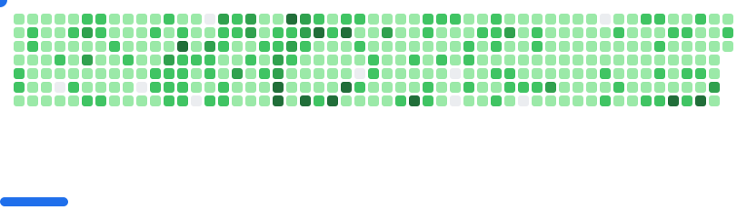

Hi!

I am Cees-Jan Kiewiet.

All new major package releases will be in PHP 8.4, and most most minor updates will also be raised to 8.4 when doing update rounds. In specific situations, a final release for the previous PHP version will be made before bumping to 8.4 in the next right after.

---

#### 💻 Check out what I'm currently working on

- [WyriHaximus/github-workflows](https://github.com/WyriHaximus/github-workflows) (today)
- [jakubkulhan/bunny](https://github.com/jakubkulhan/bunny) (today)
- [WyriHaximusNet/docker-php](https://github.com/WyriHaximusNet/docker-php) (1 day ago)
- [WyriHaximusNet/docker-github-action-runner](https://github.com/WyriHaximusNet/docker-github-action-runner) (1 day ago)
- [MammatusPHP/open-telemetry](https://github.com/MammatusPHP/open-telemetry) (3 days ago)
- [WyriHaximus/php-test-utilities](https://github.com/WyriHaximus/php-test-utilities) (4 days ago)
- [MammatusPHP/renovate-runner](https://github.com/MammatusPHP/renovate-runner) (4 days ago)
- [WyriHaximus/php-phpstan-rules-wrapper](https://github.com/WyriHaximus/php-phpstan-rules-wrapper) (4 days ago)
- [WyriHaximus/github-action-composer-php-versions-in-range](https://github.com/WyriHaximus/github-action-composer-php-versions-in-range) (5 days ago)
- [WyriHaximus/github-action-oci-image-supported-platforms](https://github.com/WyriHaximus/github-action-oci-image-supported-platforms) (6 days ago)
- [WyriHaximus/github-action-composer.lock-diff](https://github.com/WyriHaximus/github-action-composer.lock-diff) (6 days ago)
- [WyriHaximus/github-action-get-milestones](https://github.com/WyriHaximus/github-action-get-milestones) (6 days ago)
- [WyriHaximus/php-coding-standard](https://github.com/WyriHaximus/php-coding-standard) (1 week ago)

---

### 📜 My latest articles on [WyriHaximus.net](https://blog.wyrihaximus.net/)

- [Unlock Composer Plugins by Self Hosting Renovate](https://blog.wyrihaximus.net/2025/10/unlock-composer-plugins-by-self-hosting-renovate/) (6 months ago)
- [ReactPHP Parallel v2(.1)](https://blog.wyrihaximus.net/2025/06/reactphp-parallel-v2-/) (10 months ago)
- [Announcing TestInfra Action](https://blog.wyrihaximus.net/2025/03/announcing-testinfra-action/) (1 year ago)
- [Building a kubernetes homelab with Raspberry Pi and Lego: Nodes: Enclosure](https://blog.wyrihaximus.net/2024/12/building-a-kubernetes-homelab-with-raspberry-pies-and-lego-nodes-enclosure/) (1 year ago)
- [Building Secure Images with GitHub Actions](https://blog.wyrihaximus.net/2024/10/building-secure-images-with-github-actions/) (2 years ago)
- [Building a kubernetes homelab with Raspberry Pi and Lego: Nodes: Power](https://blog.wyrihaximus.net/2024/09/building-a-kubernetes-homelab-with-raspberry-pies-and-lego-nodes-power/) (2 years ago)
- [Building a kubernetes homelab with Raspberry Pi and Lego: Nodes: Storage](https://blog.wyrihaximus.net/2024/08/building-a-kubernetes-homelab-with-raspberry-pies-and-lego-nodes-storage/) (2 years ago)
- [Building a kubernetes homelab with Raspberry Pi and Lego: Network: Switch](https://blog.wyrihaximus.net/2024/07/building-a-kubernetes-homelab-with-raspberry-pies-and-lego-network-switch/) (2 years ago)
- [Updating (PHP) packages to ReactPHP Promise v3, and test your types with PHPStan](https://blog.wyrihaximus.net/2024/06/updating-php-packages-to-reactphp-promise-v3--and-test-your-types-with-phpstan/) (2 years ago)
- [Always recreating a TerraForm resource](https://blog.wyrihaximus.net/2024/04/always-recreating-a-terraform-resource/) (2 years ago)

---

<picture>
  <source
    media="(prefers-color-scheme: dark)"
    srcset="images/breakout-dark.svg"
  />
  <source
    media="(prefers-color-scheme: light)"
    srcset="images/breakout-light.svg"
  />
  
</picture>

---

#### 🌱 My latest projects

- [WyriHaximus/rector-composer-unused-php-parser-bug-repo](https://github.com/WyriHaximus/rector-composer-unused-php-parser-bug-repo) - 
- [WyriHaximus/infectionphp-phpstan-2417](https://github.com/WyriHaximus/infectionphp-phpstan-2417) - 
- [WyriHaximus/github-template-renovate-runner](https://github.com/WyriHaximus/github-template-renovate-runner) - GitHub Template repository for setting up self hosted Renovate Runners on GitHub Actions with my preferred config
- [WyriHaximus/github-action-renovatebot](https://github.com/WyriHaximus/github-action-renovatebot) - Wrapper around renovatebot/github-action
- [WyriHaximus/renovate-runner](https://github.com/WyriHaximus/renovate-runner) - renovate-runner
- [WyriHaximus/hass-entity-to-prometheus-push-gateway](https://github.com/WyriHaximus/hass-entity-to-prometheus-push-gateway) - 
- [WyriHaximus/github-action-testinfra](https://github.com/WyriHaximus/github-action-testinfra) - GitHub Action running your TestInfra tests
- [WyriHaximus/github-action-oci-image-supported-platforms](https://github.com/WyriHaximus/github-action-oci-image-supported-platforms) - 
- [WyriHaximus/hacs-prometheus-pushgateway](https://github.com/WyriHaximus/hacs-prometheus-pushgateway) - Home Assistant addon that pushes entity state changes to a Prometheus PushGateway
- [WyriHaximus/php-generative-composer-plugin-tooling](https://github.com/WyriHaximus/php-generative-composer-plugin-tooling) - Tooling for creating generative Composer Plugins
- [WyriHaximus/Makefiles](https://github.com/WyriHaximus/Makefiles) - Makefile building blocks
- [WyriHaximus/playground-github-action-mixed-js-docker](https://github.com/WyriHaximus/playground-github-action-mixed-js-docker) - Playground to work on shared workflows
- [WyriHaximus/php-tile-stitcher](https://github.com/WyriHaximus/php-tile-stitcher) - 

---

#### 🔭 Latest releases I've contributed to

- [WyriHaximus/github-action-composer-php-versions-in-range](https://github.com/WyriHaximus/github-action-composer-php-versions-in-range) ([v2.0.0](https://github.com/WyriHaximus/github-action-composer-php-versions-in-range/releases/tag/v2.0.0), 5 days ago) - GitHub Action that gets the PHP versions in range from composer.json
- [WyriHaximus/Makefiles](https://github.com/WyriHaximus/Makefiles) ([0.10.3](https://github.com/WyriHaximus/Makefiles/releases/tag/0.10.3), 2 weeks ago) - Makefile building blocks
- [WyriHaximus/reactphp-opportunistic-tls](https://github.com/WyriHaximus/reactphp-opportunistic-tls) ([1.0.2](https://github.com/WyriHaximus/reactphp-opportunistic-tls/releases/tag/1.0.2), 2 weeks ago) - 
- [WyriHaximus/php-fake-php-version](https://github.com/WyriHaximus/php-fake-php-version) ([1.9.28](https://github.com/WyriHaximus/php-fake-php-version/releases/tag/1.9.28), 2 weeks ago) - Ever wanted a fake non-existing version number of PHP, well this package is for you!
- [WyriHaximus/php-generative-composer-plugin-tooling](https://github.com/WyriHaximus/php-generative-composer-plugin-tooling) ([1.5.0](https://github.com/WyriHaximus/php-generative-composer-plugin-tooling/releases/tag/1.5.0), 3 weeks ago) - Tooling for creating generative Composer Plugins
- [WyriHaximus/reactphp-awaitable-observable](https://github.com/WyriHaximus/reactphp-awaitable-observable) ([1.2.1](https://github.com/WyriHaximus/reactphp-awaitable-observable/releases/tag/1.2.1), 1 month ago) - Make observables foreachable using async &amp; await
- [WyriHaximus/php-phpstan-rules-wrapper](https://github.com/WyriHaximus/php-phpstan-rules-wrapper) ([12.2.0](https://github.com/WyriHaximus/php-phpstan-rules-wrapper/releases/tag/12.2.0), 1 month ago) - 🌯 PHPStan rules wrapper
- [MammatusPHP/queue-attributes](https://github.com/MammatusPHP/queue-attributes) ([0.2.0](https://github.com/MammatusPHP/queue-attributes/releases/tag/0.2.0), 1 month ago) - 
- [MammatusPHP/groups](https://github.com/MammatusPHP/groups) ([0.1.4](https://github.com/MammatusPHP/groups/releases/tag/0.1.4), 1 month ago) - Group different components of you app into one process
- [WyriHaximus/php-broadcast](https://github.com/WyriHaximus/php-broadcast) ([2.6.1](https://github.com/WyriHaximus/php-broadcast/releases/tag/2.6.1), 1 month ago) - PSR-14 Event Processing and Notification package
- [WyriHaximus/github-action-renovatebot](https://github.com/WyriHaximus/github-action-renovatebot) ([v0.15.0](https://github.com/WyriHaximus/github-action-renovatebot/releases/tag/v0.15.0), 1 month ago) - Wrapper around renovatebot/github-action
- [WyriHaximus/github-action-get-previous-tag](https://github.com/WyriHaximus/github-action-get-previous-tag) ([v2.0.0](https://github.com/WyriHaximus/github-action-get-previous-tag/releases/tag/v2.0.0), 1 month ago) - Get the previous tag
- [repository-situations/project-with-monotonicly-increasing-integer-as-version](https://github.com/repository-situations/project-with-monotonicly-increasing-integer-as-version) ([twee](https://github.com/repository-situations/project-with-monotonicly-increasing-integer-as-version/releases/tag/twee), 1 month ago) - Project with Monotonicly increasing Integer as Version

---

#### 🔨 My recent Pull Requests

- [[0.6.x] Always clear heartbeat timer](https://github.com/jakubkulhan/bunny/pull/220) on [jakubkulhan/bunny](https://github.com/jakubkulhan/bunny) (today)
- [Ensure lower case is done before retagging](https://github.com/WyriHaximus/github-workflows/pull/190) on [WyriHaximus/github-workflows](https://github.com/WyriHaximus/github-workflows) (today)
- [Support spreading OCI build over multiple runners](https://github.com/WyriHaximus/github-workflows/pull/189) on [WyriHaximus/github-workflows](https://github.com/WyriHaximus/github-workflows) (today)
- [Use platforms from `wyrihaximus/github-action-oci-image-supported-platforms` when setting up buildx](https://github.com/WyriHaximus/github-workflows/pull/188) on [WyriHaximus/github-workflows](https://github.com/WyriHaximus/github-workflows) (2 days ago)
- [[CI] make QA runs on configurable](https://github.com/WyriHaximus/github-workflows/pull/187) on [WyriHaximus/github-workflows](https://github.com/WyriHaximus/github-workflows) (2 days ago)
- [Update Node version from 20 to 24](https://github.com/WyriHaximus/github-action-composer-php-versions-in-range/pull/69) on [WyriHaximus/github-action-composer-php-versions-in-range](https://github.com/WyriHaximus/github-action-composer-php-versions-in-range) (5 days ago)
- [[0.6.x] Add simple wait for RabbitMQ build with Bunny](https://github.com/jakubkulhan/bunny/pull/216) on [jakubkulhan/bunny](https://github.com/jakubkulhan/bunny) (2 weeks ago)
- [Mark *.db2 as binary](https://github.com/WyriHaximus/Makefiles/pull/186) on [WyriHaximus/Makefiles](https://github.com/WyriHaximus/Makefiles) (2 weeks ago)
- [PHP8.5 compat - Part II](https://github.com/WyriHaximus/reactphp-opportunistic-tls/pull/28) on [WyriHaximus/reactphp-opportunistic-tls](https://github.com/WyriHaximus/reactphp-opportunistic-tls) (2 weeks ago)
- [[New Version] Update versions file to PHP 8.5.4](https://github.com/WyriHaximus/php-fake-php-version/pull/180) on [WyriHaximus/php-fake-php-version](https://github.com/WyriHaximus/php-fake-php-version) (2 weeks ago)
- [[0.6.x] Add mock client and channel objects](https://github.com/jakubkulhan/bunny/pull/215) on [jakubkulhan/bunny](https://github.com/jakubkulhan/bunny) (2 weeks ago)
- [[0.6.x] Make connection take ClientInterface](https://github.com/jakubkulhan/bunny/pull/214) on [jakubkulhan/bunny](https://github.com/jakubkulhan/bunny) (2 weeks ago)
- [Introduce action that automates CI version matrix](https://github.com/ReactiveX/RxPHP/pull/227) on [ReactiveX/RxPHP](https://github.com/ReactiveX/RxPHP) (2 weeks ago)

---

#### ⭐ Recent Stars

- [aukedejong/lovelace-windrose-card](https://github.com/aukedejong/lovelace-windrose-card) - Home Assistant Lovelace Windrose Card (5 days ago)
- [immich-app/immich](https://github.com/immich-app/immich) - High performance self-hosted photo and video management solution. (6 days ago)
- [Nicxe/f1-sensor-live-data-card](https://github.com/Nicxe/f1-sensor-live-data-card) - Custom Lovelace card for the F1 Sensor integration in Home Assistant — live race data, tyre statistics, and more. (2 weeks ago)
- [BlkLeg/CircuitBreaker](https://github.com/BlkLeg/CircuitBreaker) - Bring your homelab to life. A self-hosted IPAM and service mapper that visualizes complex hardware, compute, and network relationships in real-time. (2 weeks ago)
- [ruvnet/RuView](https://github.com/ruvnet/RuView) - π RuView: WiFi DensePose turns commodity WiFi signals into real-time human pose estimation, vital sign monitoring, and presence detection — all without a single pixel of video.  (3 weeks ago)
- [frenck/home-assistant-doom](https://github.com/frenck/home-assistant-doom) - But... Can Home Assistant run DOOM? Yes it can! (4 weeks ago)
- [patchlevel/rango](https://github.com/patchlevel/rango) - Rango is a high-performance PHP library that reimplements the MongoDB PHP API on top of PostgreSQL using the power of JSONB (1 month ago)
- [allape/openkvm](https://github.com/allape/openkvm) - DIY KVM for remote-controlling a computer even in BIOS (1 month ago)
- [xez7082/spa-card](https://github.com/xez7082/spa-card) - 🛁 Une carte Lovelace élégante et moderne pour piloter votre Spa ou Jacuzzi. Compatible avec le design Glassmorphism et les effets Néon. 🌊 (1 month ago)
- [unwrntd/peek](https://github.com/unwrntd/peek) -  (1 month ago)
- [cfinke/EpsteIn](https://github.com/cfinke/EpsteIn) - See which of your LinkedIn connections appear in the Epstein files. (1 month ago)
- [Giorgio866/lumina-energy-card](https://github.com/Giorgio866/lumina-energy-card) - Ultra Modern 3D Home Assistant dashboard card for monitoring electricity. It includes house usage, Battery States. EV Charging and multiple solar arrays (1 month ago)
- [davepl/vector](https://github.com/davepl/vector) -  (1 month ago)

---

#### ❤️ These awesome people sponsor me (thank you!)

- [challgren](https://github.com/challgren) (1 year ago)
- [edorian](https://github.com/edorian) (2 years ago)
- [codecov](https://github.com/codecov) (2 years ago)
- [mangkepwing143](https://github.com/mangkepwing143) (3 years ago)
- [jeromegamez](https://github.com/jeromegamez) (3 years ago)
- [kristos80](https://github.com/kristos80) (3 years ago)
- [getflights](https://github.com/getflights) (4 years ago)
- [csev](https://github.com/csev) (4 years ago)
- [erikaheidi](https://github.com/erikaheidi) (6 years ago)
- [AllenJB](https://github.com/AllenJB) (6 years ago)
- [lcobucci](https://github.com/lcobucci) (6 years ago)
- [Ocramius](https://github.com/Ocramius) (6 years ago)

---

#### 👯 Check out some of my recent followers

- [sahmed0](https://github.com/sahmed0)
- [onlydegen](https://github.com/onlydegen)
- [mmallikpy](https://github.com/mmallikpy)
- [xez7082](https://github.com/xez7082)
- [faizul2050](https://github.com/faizul2050)

---

#### 📫 How to reach me

- Mastodon: [@wyri@haxim.us](https://toot-toot.wyrihaxim.us/@wyri)
- BlueSky: [@wyri@haxim.us](https://bsky.app/profile/wyrihaxim.us)
- Blog: [blog.wyrihaximus.net](https://blog.wyrihaximus.net/)
- Website: [WyriHaximus.net](https://wyrihaximus.net/)
- Email: [github@ceesjankiewiet.nl](mailto:github@ceesjankiewiet.nl)
- The X formally known as Twitter: [@WyriHaximus](https://twitter.com/WyriHaximus)

---

