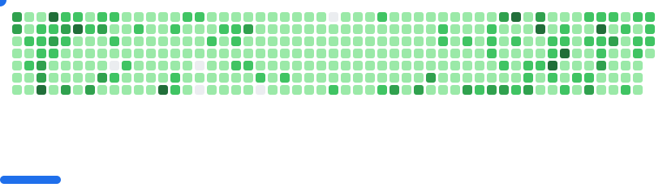

Hi!

I am Cees-Jan Kiewiet.

All new major package releases will be in PHP 8.4, and most most minor updates will also be raised to 8.4 when doing update rounds. In specific situations, a final release for the previous PHP version will be made before bumping to 8.4 in the next right after.

---

#### 💻 Check out what I'm currently working on

- [WyriHaximus/php-qa-tooling-wrapper](https://github.com/WyriHaximus/php-qa-tooling-wrapper) (1 day ago)
- [WyriHaximus/phpstan-no-safe](https://github.com/WyriHaximus/phpstan-no-safe) (1 day ago)
- [jakubkulhan/bunny](https://github.com/jakubkulhan/bunny) (1 day ago)
- [WyriHaximus/Makefiles](https://github.com/WyriHaximus/Makefiles) (1 day ago)
- [WyriHaximus/php-test-utilities](https://github.com/WyriHaximus/php-test-utilities) (2 days ago)
- [WyriHaximus/php-coding-standard](https://github.com/WyriHaximus/php-coding-standard) (2 days ago)
- [WyriHaximus/php-async-test-utilities](https://github.com/WyriHaximus/php-async-test-utilities) (2 days ago)
- [WyriHaximus/php-phpstan-rules-wrapper](https://github.com/WyriHaximus/php-phpstan-rules-wrapper) (2 days ago)
- [WyriHaximus/reactphp-cache-redis](https://github.com/WyriHaximus/reactphp-cache-redis) (4 days ago)
- [WyriHaximus/reactphp-http-middleware-session](https://github.com/WyriHaximus/reactphp-http-middleware-session) (4 days ago)
- [WyriHaximus/php-json-throwable](https://github.com/WyriHaximus/php-json-throwable) (4 days ago)
- [WyriHaximus/php-generative-composer-plugin-tooling](https://github.com/WyriHaximus/php-generative-composer-plugin-tooling) (4 days ago)
- [WyriHaximus/php-broadcast](https://github.com/WyriHaximus/php-broadcast) (4 days ago)

---

### 📜 My latest articles on [WyriHaximus.net](https://blog.wyrihaximus.net/)

- [Unlock Composer Plugins by Self Hosting Renovate](https://blog.wyrihaximus.net/2025/10/unlock-composer-plugins-by-self-hosting-renovate/) (10 months ago)
- [ReactPHP Parallel v2(.1)](https://blog.wyrihaximus.net/2025/06/reactphp-parallel-v2-/) (1 year ago)
- [Announcing TestInfra Action](https://blog.wyrihaximus.net/2025/03/announcing-testinfra-action/) (1 year ago)
- [Building a kubernetes homelab with Raspberry Pi and Lego: Nodes: Enclosure](https://blog.wyrihaximus.net/2024/12/building-a-kubernetes-homelab-with-raspberry-pies-and-lego-nodes-enclosure/) (2 years ago)
- [Building Secure Images with GitHub Actions](https://blog.wyrihaximus.net/2024/10/building-secure-images-with-github-actions/) (2 years ago)
- [Building a kubernetes homelab with Raspberry Pi and Lego: Nodes: Power](https://blog.wyrihaximus.net/2024/09/building-a-kubernetes-homelab-with-raspberry-pies-and-lego-nodes-power/) (2 years ago)
- [Building a kubernetes homelab with Raspberry Pi and Lego: Nodes: Storage](https://blog.wyrihaximus.net/2024/08/building-a-kubernetes-homelab-with-raspberry-pies-and-lego-nodes-storage/) (2 years ago)
- [Building a kubernetes homelab with Raspberry Pi and Lego: Network: Switch](https://blog.wyrihaximus.net/2024/07/building-a-kubernetes-homelab-with-raspberry-pies-and-lego-network-switch/) (2 years ago)
- [Updating (PHP) packages to ReactPHP Promise v3, and test your types with PHPStan](https://blog.wyrihaximus.net/2024/06/updating-php-packages-to-reactphp-promise-v3--and-test-your-types-with-phpstan/) (2 years ago)
- [Always recreating a TerraForm resource](https://blog.wyrihaximus.net/2024/04/always-recreating-a-terraform-resource/) (2 years ago)

---

<picture>
  <source
    media="(prefers-color-scheme: dark)"
    srcset="images/breakout-dark.svg"
  />
  <source
    media="(prefers-color-scheme: light)"
    srcset="images/breakout-light.svg"
  />
  
</picture>

---

#### 🌱 My latest projects

- [WyriHaximus/rectorphp-config](https://github.com/WyriHaximus/rectorphp-config) - My RectorPHP configuration tooling and additional rules 
- [WyriHaximus/php-qa-tooling-wrapper](https://github.com/WyriHaximus/php-qa-tooling-wrapper) - QA Tooling Wrapper for `wyrihaximus/test-utilities`
- [WyriHaximus/bug-free-chainsaw](https://github.com/WyriHaximus/bug-free-chainsaw) - Test out `github-workflows` release changes
- [WyriHaximus/phpstan-no-safe](https://github.com/WyriHaximus/phpstan-no-safe) - PHPStan extension that detects and blocks any usage of `thecodingmachine/safe`
- [WyriHaximus/rector-composer-unused-php-parser-bug-repo](https://github.com/WyriHaximus/rector-composer-unused-php-parser-bug-repo) - 
- [WyriHaximus/infectionphp-phpstan-2417](https://github.com/WyriHaximus/infectionphp-phpstan-2417) - 
- [WyriHaximus/github-template-renovate-runner](https://github.com/WyriHaximus/github-template-renovate-runner) - GitHub Template repository for setting up self hosted Renovate Runners on GitHub Actions with my preferred config
- [WyriHaximus/github-action-renovatebot](https://github.com/WyriHaximus/github-action-renovatebot) - Wrapper around renovatebot/github-action
- [WyriHaximus/renovate-runner](https://github.com/WyriHaximus/renovate-runner) - renovate-runner
- [WyriHaximus/hass-entity-to-prometheus-push-gateway](https://github.com/WyriHaximus/hass-entity-to-prometheus-push-gateway) - 
- [WyriHaximus/github-action-testinfra](https://github.com/WyriHaximus/github-action-testinfra) - GitHub Action running your TestInfra tests
- [WyriHaximus/github-action-oci-image-supported-platforms](https://github.com/WyriHaximus/github-action-oci-image-supported-platforms) - 
- [WyriHaximus/hacs-prometheus-pushgateway](https://github.com/WyriHaximus/hacs-prometheus-pushgateway) - Home Assistant addon that pushes entity state changes to a Prometheus PushGateway

---

#### 🔭 Latest releases I've contributed to

- [WyriHaximus/rectorphp-config](https://github.com/WyriHaximus/rectorphp-config) ([1.0.0](https://github.com/WyriHaximus/rectorphp-config/releases/tag/1.0.0), 1 day ago) - My RectorPHP configuration tooling and additional rules 
- [WyriHaximus/php-qa-tooling-wrapper](https://github.com/WyriHaximus/php-qa-tooling-wrapper) ([2.0.0](https://github.com/WyriHaximus/php-qa-tooling-wrapper/releases/tag/2.0.0), 1 day ago) - QA Tooling Wrapper for `wyrihaximus/test-utilities`
- [WyriHaximus/php-async-test-utilities](https://github.com/WyriHaximus/php-async-test-utilities) ([13.5.2](https://github.com/WyriHaximus/php-async-test-utilities/releases/tag/13.5.2), 2 days ago) - 
- [WyriHaximus/php-test-utilities](https://github.com/WyriHaximus/php-test-utilities) ([13.5.2](https://github.com/WyriHaximus/php-test-utilities/releases/tag/13.5.2), 2 days ago) - 
- [WyriHaximus/php-phpstan-rules-wrapper](https://github.com/WyriHaximus/php-phpstan-rules-wrapper) ([14.4.0](https://github.com/WyriHaximus/php-phpstan-rules-wrapper/releases/tag/14.4.0), 2 days ago) - 🌯 PHPStan rules wrapper
- [WyriHaximus/phpstan-no-safe](https://github.com/WyriHaximus/phpstan-no-safe) ([1.1.0](https://github.com/WyriHaximus/phpstan-no-safe/releases/tag/1.1.0), 2 days ago) - PHPStan extension that detects and blocks any usage of `thecodingmachine/safe`
- [WyriHaximus/php-coding-standard](https://github.com/WyriHaximus/php-coding-standard) ([4.3.0](https://github.com/WyriHaximus/php-coding-standard/releases/tag/4.3.0), 3 days ago) - PHP Coding Standard
- [jakubkulhan/bunny](https://github.com/jakubkulhan/bunny) ([v0.6.0-alpha.4](https://github.com/jakubkulhan/bunny/releases/tag/v0.6.0-alpha.4), 6 days ago) - Performant pure-PHP AMQP (RabbitMQ) sync/async (ReactPHP) library
- [MammatusPHP/terraform-events](https://github.com/MammatusPHP/terraform-events) ([0.1.1](https://github.com/MammatusPHP/terraform-events/releases/tag/0.1.1), 1 week ago) - Events for the `terraform` packagfe
- [WyriHaximus/Makefiles](https://github.com/WyriHaximus/Makefiles) ([0.13.3](https://github.com/WyriHaximus/Makefiles/releases/tag/0.13.3), 1 week ago) - Makefile building blocks
- [WyriHaximus/php-fake-php-version](https://github.com/WyriHaximus/php-fake-php-version) ([1.9.33](https://github.com/WyriHaximus/php-fake-php-version/releases/tag/1.9.33), 1 week ago) - Ever wanted a fake non-existing version number of PHP, well this package is for you!
- [WyriHaximus/php-generative-composer-plugin-tooling](https://github.com/WyriHaximus/php-generative-composer-plugin-tooling) ([1.8.3](https://github.com/WyriHaximus/php-generative-composer-plugin-tooling/releases/tag/1.8.3), 2 weeks ago) - Tooling for creating generative Composer Plugins
- [WyriHaximus/reactphp-cache-psr-16-adapter](https://github.com/WyriHaximus/reactphp-cache-psr-16-adapter) ([1.2.0](https://github.com/WyriHaximus/reactphp-cache-psr-16-adapter/releases/tag/1.2.0), 3 weeks ago) - 

---

#### 🔨 My recent Pull Requests

- [Add Coverage GUard to enforce test coverage](https://github.com/WyriHaximus/Makefiles/pull/260) on [WyriHaximus/Makefiles](https://github.com/WyriHaximus/Makefiles) (1 day ago)
- [Add support for extra services](https://github.com/WyriHaximus/Makefiles/pull/259) on [WyriHaximus/Makefiles](https://github.com/WyriHaximus/Makefiles) (1 day ago)
- [Switch to `WyriHaximus/rectorphp-config`](https://github.com/WyriHaximus/phpstan-no-safe/pull/10) on [WyriHaximus/phpstan-no-safe](https://github.com/WyriHaximus/phpstan-no-safe) (1 day ago)
- [Extract RectorPHP config and rules here](https://github.com/WyriHaximus/rectorphp-config/pull/1) on [WyriHaximus/rectorphp-config](https://github.com/WyriHaximus/rectorphp-config) (1 day ago)
- [Drop `wyrihaximus/phpstan-rules-wrapper`](https://github.com/WyriHaximus/php-qa-tooling-wrapper/pull/13) on [WyriHaximus/php-qa-tooling-wrapper](https://github.com/WyriHaximus/php-qa-tooling-wrapper) (1 day ago)
- [Fix `rmDir`](https://github.com/WyriHaximus/php-test-utilities/pull/1320) on [WyriHaximus/php-test-utilities](https://github.com/WyriHaximus/php-test-utilities) (3 days ago)
- [[0.6.x] Update examples to RabbitMQ v4](https://github.com/jakubkulhan/bunny/pull/234) on [jakubkulhan/bunny](https://github.com/jakubkulhan/bunny) (3 days ago)
- [More performant hydrator lookup](https://github.com/php-openapi-tools/generator-psr-15-webhook-middleware/pull/2) on [php-openapi-tools/generator-psr-15-webhook-middleware](https://github.com/php-openapi-tools/generator-psr-15-webhook-middleware) (3 days ago)
- [Add Basic WebHooks data set](https://github.com/php-openapi-tools/test-data/pull/5) on [php-openapi-tools/test-data](https://github.com/php-openapi-tools/test-data) (4 days ago)
- [Add webhook handler interface](https://github.com/php-openapi-tools/contract/pull/4) on [php-openapi-tools/contract](https://github.com/php-openapi-tools/contract) (4 days ago)
- [Initial set up](https://github.com/php-openapi-tools/generator-psr-15-webhook-middleware/pull/1) on [php-openapi-tools/generator-psr-15-webhook-middleware](https://github.com/php-openapi-tools/generator-psr-15-webhook-middleware) (4 days ago)
- [Swap `pointy-beardreverse/regex` for `ilario-pierbattista/reverse-regex`](https://github.com/php-openapi-tools/gatherer/pull/8) on [php-openapi-tools/gatherer](https://github.com/php-openapi-tools/gatherer) (4 days ago)
- [Initial set up](https://github.com/WyriHaximus/php-qa-tooling-wrapper/pull/1) on [WyriHaximus/php-qa-tooling-wrapper](https://github.com/WyriHaximus/php-qa-tooling-wrapper) (5 days ago)

---

#### ⭐ Recent Stars

- [jakubkulhan/caddy-chrome](https://github.com/jakubkulhan/caddy-chrome) - Caddy middleware to server-side render Javascript applications using Chrome (3 days ago)
- [ilario-pierbattista/ReverseRegex](https://github.com/ilario-pierbattista/ReverseRegex) - Use Regular Expressions to generate text string in PHP. (5 days ago)
- [pointybeard-forks/reverse-regex](https://github.com/pointybeard-forks/reverse-regex) - Use Regular Expressions to generate text string in PHP. (5 days ago)
- [shipmonk-rnd/coverage-guard](https://github.com/shipmonk-rnd/coverage-guard) - 🧪 Enforce PHP code coverage in your CI. Not by percentage, but target core methods! Allows you to start enforcing coverage for new code only!   Also contains tooling to merge and convert PHPUnit coverage files. (5 days ago)
- [Jamesits/docker-ripe-atlas](https://github.com/Jamesits/docker-ripe-atlas) - This is the RIPE Atlas software probe packaged as a Docker image. (1 week ago)
- [rasbt/LLMs-from-scratch](https://github.com/rasbt/LLMs-from-scratch) - Implement a ChatGPT-like LLM in PyTorch from scratch, step by step (1 week ago)
- [rasbt/reasoning-from-scratch](https://github.com/rasbt/reasoning-from-scratch) - Implement a reasoning LLM in PyTorch from scratch, step by step (1 week ago)
- [phpstan/turbo-ext](https://github.com/phpstan/turbo-ext) - [READ ONLY] Split of turbo-ext directory from phpstan-src repository. phpstan_turbo is a native acceleration extension for PHPStan. (1 week ago)
- [raven-actions/bot-details](https://github.com/raven-actions/bot-details) - 🤖 Get bot details (name, email, author/committer) in a proper format for the subsequence steps like git, PR, and more. (2 weeks ago)
- [github/github-mcp-server](https://github.com/github/github-mcp-server) - GitHub&#39;s official MCP Server (2 weeks ago)
- [amazon-mq/rabbitmq-stream-s3](https://github.com/amazon-mq/rabbitmq-stream-s3) - A RabbitMQ plugin for practically infinite stream storage in S3 (2 weeks ago)
- [amazon-mq/mcp-server-rabbitmq](https://github.com/amazon-mq/mcp-server-rabbitmq) - MCP server for RabbitMQ  (2 weeks ago)
- [agentsmd/agents.md](https://github.com/agentsmd/agents.md) - AGENTS.md — a simple, open format for guiding coding agents (2 weeks ago)

---

#### ❤️ These awesome people sponsor me (thank you!)

- [challgren](https://github.com/challgren) (1 year ago)
- [edorian](https://github.com/edorian) (2 years ago)
- [mangkepwing143](https://github.com/mangkepwing143) (3 years ago)
- [jeromegamez](https://github.com/jeromegamez) (3 years ago)
- [kristos80](https://github.com/kristos80) (3 years ago)
- [getflights](https://github.com/getflights) (4 years ago)
- [erikaheidi](https://github.com/erikaheidi) (6 years ago)
- [AllenJB](https://github.com/AllenJB) (6 years ago)
- [lcobucci](https://github.com/lcobucci) (6 years ago)
- [Ocramius](https://github.com/Ocramius) (6 years ago)

---

#### 👯 Check out some of my recent followers

- [Gabrieliam42](https://github.com/Gabrieliam42)
- [charlesmorris0010-star](https://github.com/charlesmorris0010-star)
- [TestSubjectJohnDoe](https://github.com/TestSubjectJohnDoe)
- [chrisipanaque](https://github.com/chrisipanaque)
- [ddelrio1986](https://github.com/ddelrio1986)

---

#### 📫 How to reach me

- Mastodon: [@wyri@haxim.us](https://toot-toot.wyrihaxim.us/@wyri)
- BlueSky: [@wyri@haxim.us](https://bsky.app/profile/wyrihaxim.us)
- Blog: [blog.wyrihaximus.net](https://blog.wyrihaximus.net/)
- Website: [WyriHaximus.net](https://wyrihaximus.net/)
- Email: [github@ceesjankiewiet.nl](mailto:github@ceesjankiewiet.nl)
- The X formally known as Twitter: [@WyriHaximus](https://twitter.com/WyriHaximus)

---

