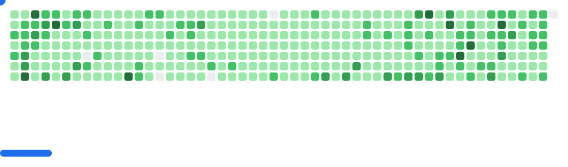

Hi!

I am Cees-Jan Kiewiet.

All new major package releases will be in PHP 8.4, and most most minor updates will also be raised to 8.4 when doing update rounds. In specific situations, a final release for the previous PHP version will be made before bumping to 8.4 in the next right after.

---

#### 💻 Check out what I'm currently working on

- [WyriHaximus/renovate-runner](https://github.com/WyriHaximus/renovate-runner) (today)
- [MammatusPHP/http-server-contracts](https://github.com/MammatusPHP/http-server-contracts) (today)
- [MammatusPHP/http-server-webroot](https://github.com/MammatusPHP/http-server-webroot) (today)
- [WyriHaximus/Makefiles](https://github.com/WyriHaximus/Makefiles) (today)
- [MammatusPHP/kubernetes](https://github.com/MammatusPHP/kubernetes) (today)
- [MammatusPHP/http-server-attributes](https://github.com/MammatusPHP/http-server-attributes) (today)
- [WyriHaximus/github-action-renovatebot](https://github.com/WyriHaximus/github-action-renovatebot) (today)
- [MammatusPHP/http-server](https://github.com/MammatusPHP/http-server) (today)
- [MammatusPHP/healthz-vhost](https://github.com/MammatusPHP/healthz-vhost) (today)
- [MammatusPHP/cron-attributes](https://github.com/MammatusPHP/cron-attributes) (1 day ago)
- [php-openapi-tools/representation](https://github.com/php-openapi-tools/representation) (1 day ago)
- [MammatusPHP/kubernetes-attributes](https://github.com/MammatusPHP/kubernetes-attributes) (1 day ago)
- [MammatusPHP/terraform-events](https://github.com/MammatusPHP/terraform-events) (1 day ago)

---

### 📜 My latest articles on [WyriHaximus.net](https://blog.wyrihaximus.net/)

- [Unlock Composer Plugins by Self Hosting Renovate](https://blog.wyrihaximus.net/2025/10/unlock-composer-plugins-by-self-hosting-renovate/) (1 year ago)
- [ReactPHP Parallel v2(.1)](https://blog.wyrihaximus.net/2025/06/reactphp-parallel-v2-/) (1 year ago)
- [Announcing TestInfra Action](https://blog.wyrihaximus.net/2025/03/announcing-testinfra-action/) (2 years ago)
- [Building a kubernetes homelab with Raspberry Pi and Lego: Nodes: Enclosure](https://blog.wyrihaximus.net/2024/12/building-a-kubernetes-homelab-with-raspberry-pies-and-lego-nodes-enclosure/) (2 years ago)
- [Building Secure Images with GitHub Actions](https://blog.wyrihaximus.net/2024/10/building-secure-images-with-github-actions/) (2 years ago)
- [Building a kubernetes homelab with Raspberry Pi and Lego: Nodes: Power](https://blog.wyrihaximus.net/2024/09/building-a-kubernetes-homelab-with-raspberry-pies-and-lego-nodes-power/) (2 years ago)
- [Building a kubernetes homelab with Raspberry Pi and Lego: Nodes: Storage](https://blog.wyrihaximus.net/2024/08/building-a-kubernetes-homelab-with-raspberry-pies-and-lego-nodes-storage/) (2 years ago)
- [Building a kubernetes homelab with Raspberry Pi and Lego: Network: Switch](https://blog.wyrihaximus.net/2024/07/building-a-kubernetes-homelab-with-raspberry-pies-and-lego-network-switch/) (2 years ago)
- [Updating (PHP) packages to ReactPHP Promise v3, and test your types with PHPStan](https://blog.wyrihaximus.net/2024/06/updating-php-packages-to-reactphp-promise-v3--and-test-your-types-with-phpstan/) (2 years ago)
- [Always recreating a TerraForm resource](https://blog.wyrihaximus.net/2024/04/always-recreating-a-terraform-resource/) (2 years ago)

---

<picture>
  <source
    media="(prefers-color-scheme: dark)"
    srcset="images/breakout-dark.svg"
  />
  <source
    media="(prefers-color-scheme: light)"
    srcset="images/breakout-light.svg"
  />
  
</picture>

---

#### 🌱 My latest projects

- [WyriHaximus/rectorphp-config](https://github.com/WyriHaximus/rectorphp-config) - My RectorPHP configuration tooling and additional rules 
- [WyriHaximus/php-qa-tooling-wrapper](https://github.com/WyriHaximus/php-qa-tooling-wrapper) - QA Tooling Wrapper for `wyrihaximus/test-utilities`
- [WyriHaximus/bug-free-chainsaw](https://github.com/WyriHaximus/bug-free-chainsaw) - Test out `github-workflows` release changes
- [WyriHaximus/phpstan-no-safe](https://github.com/WyriHaximus/phpstan-no-safe) - PHPStan extension that detects and blocks any usage of `thecodingmachine/safe`
- [WyriHaximus/rector-composer-unused-php-parser-bug-repo](https://github.com/WyriHaximus/rector-composer-unused-php-parser-bug-repo) - 
- [WyriHaximus/infectionphp-phpstan-2417](https://github.com/WyriHaximus/infectionphp-phpstan-2417) - 
- [WyriHaximus/github-template-renovate-runner](https://github.com/WyriHaximus/github-template-renovate-runner) - GitHub Template repository for setting up self hosted Renovate Runners on GitHub Actions with my preferred config
- [WyriHaximus/github-action-renovatebot](https://github.com/WyriHaximus/github-action-renovatebot) - Wrapper around renovatebot/github-action
- [WyriHaximus/renovate-runner](https://github.com/WyriHaximus/renovate-runner) - renovate-runner
- [WyriHaximus/hass-entity-to-prometheus-push-gateway](https://github.com/WyriHaximus/hass-entity-to-prometheus-push-gateway) - 
- [WyriHaximus/github-action-testinfra](https://github.com/WyriHaximus/github-action-testinfra) - GitHub Action running your TestInfra tests
- [WyriHaximus/github-action-oci-image-supported-platforms](https://github.com/WyriHaximus/github-action-oci-image-supported-platforms) - 
- [WyriHaximus/hacs-prometheus-pushgateway](https://github.com/WyriHaximus/hacs-prometheus-pushgateway) - Home Assistant addon that pushes entity state changes to a Prometheus PushGateway

---

#### 🔭 Latest releases I've contributed to

- [MammatusPHP/kubernetes](https://github.com/MammatusPHP/kubernetes) ([0.4.2](https://github.com/MammatusPHP/kubernetes/releases/tag/0.4.2), today) - Kubernetes related tooling
- [MammatusPHP/healthz-vhost](https://github.com/MammatusPHP/healthz-vhost) ([0.1.0](https://github.com/MammatusPHP/healthz-vhost/releases/tag/0.1.0), today) - Basic health check vhost
- [MammatusPHP/http-server-webroot](https://github.com/MammatusPHP/http-server-webroot) ([0.1.2](https://github.com/MammatusPHP/http-server-webroot/releases/tag/0.1.2), today) - Webroot implementations for HTTP server
- [MammatusPHP/http-server-contracts](https://github.com/MammatusPHP/http-server-contracts) ([0.1.0](https://github.com/MammatusPHP/http-server-contracts/releases/tag/0.1.0), today) - Contracts for the http-server
- [MammatusPHP/http-server-attributes](https://github.com/MammatusPHP/http-server-attributes) ([0.1.0](https://github.com/MammatusPHP/http-server-attributes/releases/tag/0.1.0), today) - Attributes for http-server
- [WyriHaximus/github-action-renovatebot](https://github.com/WyriHaximus/github-action-renovatebot) ([v0.16.6](https://github.com/WyriHaximus/github-action-renovatebot/releases/tag/v0.16.6), today) - Wrapper around renovatebot/github-action
- [WyriHaximus/github-workflows](https://github.com/WyriHaximus/github-workflows) ([v1.1.0](https://github.com/WyriHaximus/github-workflows/releases/tag/v1.1.0), 2 days ago) - Shared GitHub Actions Workflows
- [WyriHaximus/php-async-test-utilities](https://github.com/WyriHaximus/php-async-test-utilities) ([14.4.0](https://github.com/WyriHaximus/php-async-test-utilities/releases/tag/14.4.0), 4 days ago) - 
- [WyriHaximus/github-action-composer.lock-diff](https://github.com/WyriHaximus/github-action-composer.lock-diff) ([v3.0.0](https://github.com/WyriHaximus/github-action-composer.lock-diff/releases/tag/v3.0.0), 4 days ago) - GitHub Action that diffs composer.lock between current branch and default branch
- [WyriHaximus/php-test-utilities](https://github.com/WyriHaximus/php-test-utilities) ([14.4.0](https://github.com/WyriHaximus/php-test-utilities/releases/tag/14.4.0), 5 days ago) - 
- [WyriHaximus/php-fake-php-version](https://github.com/WyriHaximus/php-fake-php-version) ([1.9.35](https://github.com/WyriHaximus/php-fake-php-version/releases/tag/1.9.35), 5 days ago) - Ever wanted a fake non-existing version number of PHP, well this package is for you!
- [WyriHaximus/github-action-supported-php-versions](https://github.com/WyriHaximus/github-action-supported-php-versions) ([v1.39.0](https://github.com/WyriHaximus/github-action-supported-php-versions/releases/tag/v1.39.0), 6 days ago) - 
- [WyriHaximus/php-phpstan-rules-wrapper](https://github.com/WyriHaximus/php-phpstan-rules-wrapper) ([14.8.0](https://github.com/WyriHaximus/php-phpstan-rules-wrapper/releases/tag/14.8.0), 1 week ago) - 🌯 PHPStan rules wrapper

---

#### 🔨 My recent Pull Requests

- [Update to stable http-server-packages](https://github.com/MammatusPHP/kubernetes/pull/53) on [MammatusPHP/kubernetes](https://github.com/MammatusPHP/kubernetes) (today)
- [Update `mammatus/healthz-vhost` to stable release](https://github.com/MammatusPHP/http-server/pull/250) on [MammatusPHP/http-server](https://github.com/MammatusPHP/http-server) (today)
- [Add WebSocket support](https://github.com/MammatusPHP/http-server/pull/249) on [MammatusPHP/http-server](https://github.com/MammatusPHP/http-server) (today)
- [Update to tagged http-server-* packages](https://github.com/MammatusPHP/healthz-vhost/pull/49) on [MammatusPHP/healthz-vhost](https://github.com/MammatusPHP/healthz-vhost) (today)
- [Update http-server-* packages](https://github.com/MammatusPHP/http-server/pull/248) on [MammatusPHP/http-server](https://github.com/MammatusPHP/http-server) (today)
- [Update `mammatus/http-server-webroot` to 0.1.2](https://github.com/MammatusPHP/healthz-vhost/pull/48) on [MammatusPHP/healthz-vhost](https://github.com/MammatusPHP/healthz-vhost) (today)
- [Update http-server-* packages](https://github.com/MammatusPHP/healthz-vhost/pull/47) on [MammatusPHP/healthz-vhost](https://github.com/MammatusPHP/healthz-vhost) (today)
- [Bump `mammatus/http-server-contracts` to stable release](https://github.com/MammatusPHP/http-server-webroot/pull/36) on [MammatusPHP/http-server-webroot](https://github.com/MammatusPHP/http-server-webroot) (today)
- [Basic Documentation](https://github.com/MammatusPHP/http-server-webroot/pull/35) on [MammatusPHP/http-server-webroot](https://github.com/MammatusPHP/http-server-webroot) (today)
- [Basic Documentation](https://github.com/MammatusPHP/http-server-contracts/pull/48) on [MammatusPHP/http-server-contracts](https://github.com/MammatusPHP/http-server-contracts) (today)
- [Basic Documentation](https://github.com/MammatusPHP/http-server-attributes/pull/25) on [MammatusPHP/http-server-attributes](https://github.com/MammatusPHP/http-server-attributes) (today)
- [Add WebSocket attributes](https://github.com/MammatusPHP/http-server-attributes/pull/24) on [MammatusPHP/http-server-attributes](https://github.com/MammatusPHP/http-server-attributes) (today)
- [Have renovate update migrations workflows versions](https://github.com/WyriHaximus/Makefiles/pull/297) on [WyriHaximus/Makefiles](https://github.com/WyriHaximus/Makefiles) (today)

---

#### ⭐ Recent Stars

- [tphakala/birdnet-go](https://github.com/tphakala/birdnet-go) - Self-hosted realtime soundscape analyser for birds, bats and other wildlife. Multi-model local AI inference, runs 24/7 on a Raspberry Pi. (1 day ago)
- [benmac7/network-flow-card](https://github.com/benmac7/network-flow-card) -  (2 days ago)
- [shipmonk-rnd/passkeys](https://github.com/shipmonk-rnd/passkeys) - zero dependency spec-compliant passkey library for php (3 days ago)
- [yama6a/talos-raspberry-pi5](https://github.com/yama6a/talos-raspberry-pi5) -  (1 week ago)
- [cloudflare/security-audit-skill](https://github.com/cloudflare/security-audit-skill) - A coding-agent skill for multi-phase security audits with independently verified, machine-readable findings (1 week ago)
- [helm/helm-mapkubeapis](https://github.com/helm/helm-mapkubeapis) - This is a Helm plugin which map deprecated or removed Kubernetes APIs in a release to supported APIs (1 week ago)
- [arnegiacomo/fugleramme](https://github.com/arnegiacomo/fugleramme) - Bird frame for Raspberry Pi - real-time bird detection by audio, fully local AI, rendered as real, hand-cut 1800s bird illustrations. On an e-ink panel, a TV, or any screen. (1 week ago)
- [francescopace/espectre](https://github.com/francescopace/espectre) - Wi-Fi CSI motion sensing for ESP32. C&#43;&#43; SDK, ESPHome, Native, and Matter frontends, browser tools, and a CLI for the full device lifecycle. GPLv3 and commercial licensing. (3 weeks ago)
- [mnapoli/skills](https://github.com/mnapoli/skills) - Agent skills: unslop, address PR review (3 weeks ago)
- [elyosh/OpenTIE](https://github.com/elyosh/OpenTIE) -  (1 month ago)
- [php-baremetal/php-esp32](https://github.com/php-baremetal/php-esp32) - The official PHP 8.3-8.5 engine running on an ESP32-P4/ESP32-S3. No emulation, no clone: reads a PHP file from microSD and runs it. (1 month ago)
- [libgd/libgd](https://github.com/libgd/libgd) - GD Graphics Library (1 month ago)
- [GaZmagik/iso-24495](https://github.com/GaZmagik/iso-24495) - ISO 24495 Plain Language skills and Claude Code plugin (1 month ago)

---

#### ❤️ These awesome people sponsor me (thank you!)

- [challgren](https://github.com/challgren) (2 years ago)
- [edorian](https://github.com/edorian) (2 years ago)
- [mangkepwing143](https://github.com/mangkepwing143) (3 years ago)
- [jeromegamez](https://github.com/jeromegamez) (3 years ago)
- [kristos80](https://github.com/kristos80) (4 years ago)
- [getflights](https://github.com/getflights) (4 years ago)
- [erikaheidi](https://github.com/erikaheidi) (6 years ago)
- [AllenJB](https://github.com/AllenJB) (6 years ago)
- [lcobucci](https://github.com/lcobucci) (7 years ago)
- [Ocramius](https://github.com/Ocramius) (7 years ago)

---

#### 👯 Check out some of my recent followers

- [rjporosh](https://github.com/rjporosh)
- [liesbethbelmokhtar203-source](https://github.com/liesbethbelmokhtar203-source)
- [codoidieu](https://github.com/codoidieu)
- [charlesmorris0010-star](https://github.com/charlesmorris0010-star)
- [TestSubjectJohnDoe](https://github.com/TestSubjectJohnDoe)

---

#### 📫 How to reach me

- Mastodon: [@wyri@haxim.us](https://toot-toot.wyrihaxim.us/@wyri)
- BlueSky: [@wyri@haxim.us](https://bsky.app/profile/wyrihaxim.us)
- Blog: [blog.wyrihaximus.net](https://blog.wyrihaximus.net/)
- Website: [WyriHaximus.net](https://wyrihaximus.net/)
- Email: [github@ceesjankiewiet.nl](mailto:github@ceesjankiewiet.nl)
- The X formally known as Twitter: [@WyriHaximus](https://twitter.com/WyriHaximus)

---

