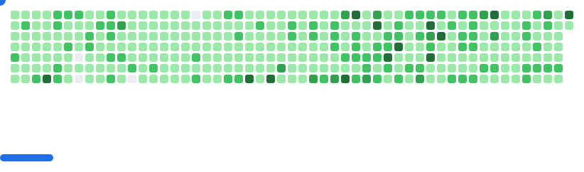

Hi!

I am Cees-Jan Kiewiet.

All new major package releases will be in PHP 8.4, and most most minor updates will also be raised to 8.4 when doing update rounds. In specific situations, a final release for the previous PHP version will be made before bumping to 8.4 in the next right after.

---

#### 💻 Check out what I'm currently working on

- [WyriHaximus/php-psr-3-context-logger](https://github.com/WyriHaximus/php-psr-3-context-logger) (today)
- [WyriHaximus/php-test-utilities](https://github.com/WyriHaximus/php-test-utilities) (today)
- [MammatusPHP/cron-attributes](https://github.com/MammatusPHP/cron-attributes) (today)
- [WyriHaximusNet/docker-php](https://github.com/WyriHaximusNet/docker-php) (today)
- [WyriHaximus/php-async-test-utilities](https://github.com/WyriHaximus/php-async-test-utilities) (today)
- [reactphp-parallel/test-pool](https://github.com/reactphp-parallel/test-pool) (today)
- [MammatusPHP/http-server](https://github.com/MammatusPHP/http-server) (today)
- [WyriHaximus/php-qa-tooling-wrapper](https://github.com/WyriHaximus/php-qa-tooling-wrapper) (today)
- [WyriHaximus/php-phpstan-rules-wrapper](https://github.com/WyriHaximus/php-phpstan-rules-wrapper) (today)
- [WyriHaximus/github-action-renovatebot](https://github.com/WyriHaximus/github-action-renovatebot) (today)
- [MammatusPHP/queue](https://github.com/MammatusPHP/queue) (today)
- [MammatusPHP/groups](https://github.com/MammatusPHP/groups) (today)
- [MammatusPHP/queue-contracts](https://github.com/MammatusPHP/queue-contracts) (today)

---

### 📜 My latest articles on [WyriHaximus.net](https://blog.wyrihaximus.net/)

- [Unlock Composer Plugins by Self Hosting Renovate](https://blog.wyrihaximus.net/2025/10/unlock-composer-plugins-by-self-hosting-renovate/) (1 year ago)
- [ReactPHP Parallel v2(.1)](https://blog.wyrihaximus.net/2025/06/reactphp-parallel-v2-/) (2 years ago)
- [Announcing TestInfra Action](https://blog.wyrihaximus.net/2025/03/announcing-testinfra-action/) (2 years ago)
- [Building a kubernetes homelab with Raspberry Pi and Lego: Nodes: Enclosure](https://blog.wyrihaximus.net/2024/12/building-a-kubernetes-homelab-with-raspberry-pies-and-lego-nodes-enclosure/) (2 years ago)
- [Building Secure Images with GitHub Actions](https://blog.wyrihaximus.net/2024/10/building-secure-images-with-github-actions/) (2 years ago)
- [Building a kubernetes homelab with Raspberry Pi and Lego: Nodes: Power](https://blog.wyrihaximus.net/2024/09/building-a-kubernetes-homelab-with-raspberry-pies-and-lego-nodes-power/) (2 years ago)
- [Building a kubernetes homelab with Raspberry Pi and Lego: Nodes: Storage](https://blog.wyrihaximus.net/2024/08/building-a-kubernetes-homelab-with-raspberry-pies-and-lego-nodes-storage/) (2 years ago)
- [Building a kubernetes homelab with Raspberry Pi and Lego: Network: Switch](https://blog.wyrihaximus.net/2024/07/building-a-kubernetes-homelab-with-raspberry-pies-and-lego-network-switch/) (2 years ago)
- [Updating (PHP) packages to ReactPHP Promise v3, and test your types with PHPStan](https://blog.wyrihaximus.net/2024/06/updating-php-packages-to-reactphp-promise-v3--and-test-your-types-with-phpstan/) (2 years ago)
- [Always recreating a TerraForm resource](https://blog.wyrihaximus.net/2024/04/always-recreating-a-terraform-resource/) (2 years ago)

---

<picture>
  <source
    media="(prefers-color-scheme: dark)"
    srcset="images/breakout-dark.svg"
  />
  <source
    media="(prefers-color-scheme: light)"
    srcset="images/breakout-light.svg"
  />
  
</picture>

---

#### 🌱 My latest projects

- [WyriHaximus/rectorphp-config](https://github.com/WyriHaximus/rectorphp-config) - My RectorPHP configuration tooling and additional rules 
- [WyriHaximus/php-qa-tooling-wrapper](https://github.com/WyriHaximus/php-qa-tooling-wrapper) - QA Tooling Wrapper for `wyrihaximus/test-utilities`
- [WyriHaximus/bug-free-chainsaw](https://github.com/WyriHaximus/bug-free-chainsaw) - Test out `github-workflows` release changes
- [WyriHaximus/phpstan-no-safe](https://github.com/WyriHaximus/phpstan-no-safe) - PHPStan extension that detects and blocks any usage of `thecodingmachine/safe`
- [WyriHaximus/rector-composer-unused-php-parser-bug-repo](https://github.com/WyriHaximus/rector-composer-unused-php-parser-bug-repo) - 
- [WyriHaximus/infectionphp-phpstan-2417](https://github.com/WyriHaximus/infectionphp-phpstan-2417) - 
- [WyriHaximus/github-template-renovate-runner](https://github.com/WyriHaximus/github-template-renovate-runner) - GitHub Template repository for setting up self hosted Renovate Runners on GitHub Actions with my preferred config
- [WyriHaximus/github-action-renovatebot](https://github.com/WyriHaximus/github-action-renovatebot) - Wrapper around renovatebot/github-action
- [WyriHaximus/renovate-runner](https://github.com/WyriHaximus/renovate-runner) - renovate-runner
- [WyriHaximus/hass-entity-to-prometheus-push-gateway](https://github.com/WyriHaximus/hass-entity-to-prometheus-push-gateway) - 
- [WyriHaximus/github-action-testinfra](https://github.com/WyriHaximus/github-action-testinfra) - GitHub Action running your TestInfra tests
- [WyriHaximus/github-action-oci-image-supported-platforms](https://github.com/WyriHaximus/github-action-oci-image-supported-platforms) - 
- [WyriHaximus/hacs-prometheus-pushgateway](https://github.com/WyriHaximus/hacs-prometheus-pushgateway) - Home Assistant addon that pushes entity state changes to a Prometheus PushGateway

---

#### 🔭 Latest releases I've contributed to

- [WyriHaximus/github-workflows](https://github.com/WyriHaximus/github-workflows) ([v1.1.4](https://github.com/WyriHaximus/github-workflows/releases/tag/v1.1.4), 1 day ago) - Shared GitHub Actions Workflows
- [WyriHaximus/github-action-composer-php-versions-in-range](https://github.com/WyriHaximus/github-action-composer-php-versions-in-range) ([v2.2.0](https://github.com/WyriHaximus/github-action-composer-php-versions-in-range/releases/tag/v2.2.0), 1 day ago) - GitHub Action that gets the PHP versions in range from composer.json
- [WyriHaximus/Makefiles](https://github.com/WyriHaximus/Makefiles) ([0.16.0](https://github.com/WyriHaximus/Makefiles/releases/tag/0.16.0), 1 day ago) - Makefile building blocks
- [WyriHaximus/github-action-renovatebot](https://github.com/WyriHaximus/github-action-renovatebot) ([v0.16.16](https://github.com/WyriHaximus/github-action-renovatebot/releases/tag/v0.16.16), 1 day ago) - Wrapper around renovatebot/github-action
- [sculpin/sculpin](https://github.com/sculpin/sculpin) ([4.0.0-alpha4](https://github.com/sculpin/sculpin/releases/tag/4.0.0-alpha4), 1 day ago) - Sculpin — Static Site Generator
- [WyriHaximus/php-generative-composer-plugin-tooling](https://github.com/WyriHaximus/php-generative-composer-plugin-tooling) ([1.9.2](https://github.com/WyriHaximus/php-generative-composer-plugin-tooling/releases/tag/1.9.2), 4 days ago) - Tooling for creating generative Composer Plugins
- [MammatusPHP/open-telemetry](https://github.com/MammatusPHP/open-telemetry) ([0.1.0](https://github.com/MammatusPHP/open-telemetry/releases/tag/0.1.0), 5 days ago) - Open Telemetry integration
- [WyriHaximus/php-fake-php-version](https://github.com/WyriHaximus/php-fake-php-version) ([1.9.37](https://github.com/WyriHaximus/php-fake-php-version/releases/tag/1.9.37), 1 week ago) - Ever wanted a fake non-existing version number of PHP, well this package is for you!
- [ReactiveX/RxPHP](https://github.com/ReactiveX/RxPHP) ([2.2.0](https://github.com/ReactiveX/RxPHP/releases/tag/2.2.0), 1 week ago) - Reactive extensions for PHP
- [MammatusPHP/kubernetes-keda](https://github.com/MammatusPHP/kubernetes-keda) ([0.1.0](https://github.com/MammatusPHP/kubernetes-keda/releases/tag/0.1.0), 1 week ago) - Keda.sh related Kubernetes tooling
- [MammatusPHP/cron](https://github.com/MammatusPHP/cron) ([0.1.0](https://github.com/MammatusPHP/cron/releases/tag/0.1.0), 2 weeks ago) - Cron manager
- [MammatusPHP/queue](https://github.com/MammatusPHP/queue) ([0.1.0](https://github.com/MammatusPHP/queue/releases/tag/0.1.0), 2 weeks ago) - 
- [MammatusPHP/kubernetes](https://github.com/MammatusPHP/kubernetes) ([0.5.1](https://github.com/MammatusPHP/kubernetes/releases/tag/0.5.1), 2 weeks ago) - Kubernetes related tooling

---

#### 🔨 My recent Pull Requests

- [[0.6.x] Bump `WyriHaximus/github-action-composer-php-versions-in-range` to v2](https://github.com/jakubkulhan/bunny/pull/244) on [jakubkulhan/bunny](https://github.com/jakubkulhan/bunny) (today)
- [Get Renovate to update Documentation images](https://github.com/WyriHaximus/Makefiles/pull/352) on [WyriHaximus/Makefiles](https://github.com/WyriHaximus/Makefiles) (1 day ago)
- [Add support for passing in specific environment vars at job level](https://github.com/WyriHaximus/Makefiles/pull/351) on [WyriHaximus/Makefiles](https://github.com/WyriHaximus/Makefiles) (1 day ago)
- [Improve resilience](https://github.com/WyriHaximus/github-action-composer-php-versions-in-range/pull/95) on [WyriHaximus/github-action-composer-php-versions-in-range](https://github.com/WyriHaximus/github-action-composer-php-versions-in-range) (3 days ago)
- [Fix `Renovate` `constraints.php` to match `composer.json`&#39;s `PHP` version constraint instead of `null`](https://github.com/WyriHaximus/Makefiles/pull/348) on [WyriHaximus/Makefiles](https://github.com/WyriHaximus/Makefiles) (4 days ago)
- [Add `yaml`, `json5`, and `yml` to `Vale`](https://github.com/WyriHaximus/Makefiles/pull/347) on [WyriHaximus/Makefiles](https://github.com/WyriHaximus/Makefiles) (4 days ago)
- [When adding vale comments to `README.md` license also make sure we did it to `etc/README.md.twig`](https://github.com/WyriHaximus/Makefiles/pull/346) on [WyriHaximus/Makefiles](https://github.com/WyriHaximus/Makefiles) (4 days ago)
- [Set `config.platform.php` in `composer.json` to the current PHP version from require with patch `13`](https://github.com/WyriHaximus/Makefiles/pull/345) on [WyriHaximus/Makefiles](https://github.com/WyriHaximus/Makefiles) (4 days ago)
- [Automate updating `etc/versions.json`](https://github.com/WyriHaximus/github-action-composer-php-versions-in-range/pull/92) on [WyriHaximus/github-action-composer-php-versions-in-range](https://github.com/WyriHaximus/github-action-composer-php-versions-in-range) (4 days ago)
- [Use tagged release management workflows](https://github.com/WyriHaximus/github-action-composer-php-versions-in-range/pull/90) on [WyriHaximus/github-action-composer-php-versions-in-range](https://github.com/WyriHaximus/github-action-composer-php-versions-in-range) (4 days ago)
- [Ignore classes with null bytes in their names](https://github.com/WyriHaximus/php-generative-composer-plugin-tooling/pull/128) on [WyriHaximus/php-generative-composer-plugin-tooling](https://github.com/WyriHaximus/php-generative-composer-plugin-tooling) (4 days ago)
- [Monkey Patch the source, not the destinations](https://github.com/MammatusPHP/open-telemetry/pull/58) on [MammatusPHP/open-telemetry](https://github.com/MammatusPHP/open-telemetry) (5 days ago)
- [Handle the PHP 8.6 Docker ZTS situation](https://github.com/WyriHaximusNet/docker-php/pull/435) on [WyriHaximusNet/docker-php](https://github.com/WyriHaximusNet/docker-php) (1 week ago)

---

#### ⭐ Recent Stars

- [phpstan/tally](https://github.com/phpstan/tally) - PHP benchmarking framework that doesn&#39;t care about wall-clock time or how fast your CPU is. (1 week ago)
- [JustVugg/colibri](https://github.com/JustVugg/colibri) - A hierarchical inference engine for frontier MoE models: hot experts on the GPU (CUDA, Vulkan), warm ones in RAM, cold ones streamed from NVMe. Written in C, runs on the hardware you already own. (3 weeks ago)
- [LiangYuxuan/wow-casc-dbc](https://github.com/LiangYuxuan/wow-casc-dbc) - Node.js tool to fetch World of Warcraft data files from CASC and parse DBC/DB2 files. (3 weeks ago)
- [boundwize/structarmed](https://github.com/boundwize/structarmed) - 🛡️ Configurable PHP architecture guards — define your layers and rules, then keep them enforced (4 weeks ago)
- [morluto/rea](https://github.com/morluto/rea) - Reverse engineer anything with agents, from app behavior down to native binaries. (1 month ago)
- [wildekek/ha-see-a-satellite](https://github.com/wildekek/ha-see-a-satellite) - See A Satellite Tonight for Home Assistant: naked-eye satellite pass predictions (HACS) (1 month ago)
- [reacherhq/check-if-email-exists](https://github.com/reacherhq/check-if-email-exists) - Check if an email address exists without sending any email, written in Rust. Comes with a ⚙️ HTTP backend. (1 month ago)
- [JoeHogan/ha-intercom](https://github.com/JoeHogan/ha-intercom) -  (1 month ago)
- [obra/superpowers](https://github.com/obra/superpowers) - An agentic skills framework &amp; software development methodology that works. (1 month ago)
- [tphakala/birdnet-go](https://github.com/tphakala/birdnet-go) - Self-hosted realtime soundscape analyser for birds, bats and other wildlife. Multi-model local AI inference, runs 24/7 on a Raspberry Pi. (2 months ago)
- [benmac7/network-flow-card](https://github.com/benmac7/network-flow-card) -  (2 months ago)
- [shipmonk-rnd/passkeys](https://github.com/shipmonk-rnd/passkeys) - zero dependency spec-compliant passkey library for php (2 months ago)
- [yama6a/talos-raspberry-pi5](https://github.com/yama6a/talos-raspberry-pi5) -  (2 months ago)

---

#### ❤️ These awesome people sponsor me (thank you!)

- [challgren](https://github.com/challgren) (2 years ago)
- [edorian](https://github.com/edorian) (2 years ago)
- [jeromegamez](https://github.com/jeromegamez) (4 years ago)
- [getflights](https://github.com/getflights) (4 years ago)
- [erikaheidi](https://github.com/erikaheidi) (6 years ago)
- [AllenJB](https://github.com/AllenJB) (6 years ago)
- [lcobucci](https://github.com/lcobucci) (7 years ago)
- [Ocramius](https://github.com/Ocramius) (7 years ago)

---

#### 👯 Check out some of my recent followers

- [yinmingskie](https://github.com/yinmingskie)
- [uforco](https://github.com/uforco)
- [Zerriox](https://github.com/Zerriox)
- [ArshiaIlaty](https://github.com/ArshiaIlaty)
- [shinycrow0128](https://github.com/shinycrow0128)

---

#### 📫 How to reach me

- Mastodon: [@wyri@haxim.us](https://toot-toot.wyrihaxim.us/@wyri)
- BlueSky: [@wyri@haxim.us](https://bsky.app/profile/wyrihaxim.us)
- Blog: [blog.wyrihaximus.net](https://blog.wyrihaximus.net/)
- Website: [WyriHaximus.net](https://wyrihaximus.net/)
- Email: [github@ceesjankiewiet.nl](mailto:github@ceesjankiewiet.nl)
- The X formally known as Twitter: [@WyriHaximus](https://twitter.com/WyriHaximus)

---

