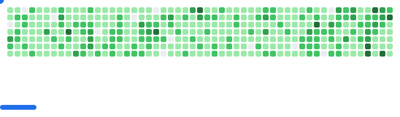

Hi!

I am Cees-Jan Kiewiet.

All new major package releases will be in PHP 8.4, and most most minor updates will also be raised to 8.4 when doing update rounds. In specific situations, a final release for the previous PHP version will be made before bumping to 8.4 in the next right after.

---

#### 💻 Check out what I'm currently working on

- [MammatusPHP/kubernetes](https://github.com/MammatusPHP/kubernetes) (today)
- [MammatusPHP/app](https://github.com/MammatusPHP/app) (today)
- [MammatusPHP/kubernetes-events](https://github.com/MammatusPHP/kubernetes-events) (today)
- [MammatusPHP/cron](https://github.com/MammatusPHP/cron) (today)
- [MammatusPHP/queue](https://github.com/MammatusPHP/queue) (today)
- [MammatusPHP/renovate-runner](https://github.com/MammatusPHP/renovate-runner) (1 day ago)
- [MammatusPHP/life-cycle-events](https://github.com/MammatusPHP/life-cycle-events) (1 day ago)
- [MammatusPHP/cron-attributes](https://github.com/MammatusPHP/cron-attributes) (2 days ago)
- [WyriHaximus/php-metrics](https://github.com/WyriHaximus/php-metrics) (2 days ago)
- [WyriHaximus/php-get-in-packages-composer.json](https://github.com/WyriHaximus/php-get-in-packages-composer.json) (2 days ago)
- [WyriHaximus/phpstan-reactphp](https://github.com/WyriHaximus/phpstan-reactphp) (3 days ago)
- [WyriHaximus/reactphp-cache-json](https://github.com/WyriHaximus/reactphp-cache-json) (3 days ago)
- [WyriHaximus/php-compress](https://github.com/WyriHaximus/php-compress) (3 days ago)

---

### 📜 My latest articles on [WyriHaximus.net](https://blog.wyrihaximus.net/)

- [Unlock Composer Plugins by Self Hosting Renovate](https://blog.wyrihaximus.net/2025/10/unlock-composer-plugins-by-self-hosting-renovate/) (2 weeks ago)
- [ReactPHP Parallel v2(.1)](https://blog.wyrihaximus.net/2025/06/reactphp-parallel-v2-/) (4 months ago)
- [Announcing TestInfra Action](https://blog.wyrihaximus.net/2025/03/announcing-testinfra-action/) (6 months ago)
- [Building a kubernetes homelab with Raspberry Pi and Lego: Nodes: Enclosure](https://blog.wyrihaximus.net/2024/12/building-a-kubernetes-homelab-with-raspberry-pies-and-lego-nodes-enclosure/) (10 months ago)
- [Building Secure Images with GitHub Actions](https://blog.wyrihaximus.net/2024/10/building-secure-images-with-github-actions/) (1 year ago)
- [Building a kubernetes homelab with Raspberry Pi and Lego: Nodes: Power](https://blog.wyrihaximus.net/2024/09/building-a-kubernetes-homelab-with-raspberry-pies-and-lego-nodes-power/) (1 year ago)
- [Building a kubernetes homelab with Raspberry Pi and Lego: Nodes: Storage](https://blog.wyrihaximus.net/2024/08/building-a-kubernetes-homelab-with-raspberry-pies-and-lego-nodes-storage/) (1 year ago)
- [Building a kubernetes homelab with Raspberry Pi and Lego: Network: Switch](https://blog.wyrihaximus.net/2024/07/building-a-kubernetes-homelab-with-raspberry-pies-and-lego-network-switch/) (1 year ago)
- [Updating (PHP) packages to ReactPHP Promise v3, and test your types with PHPStan](https://blog.wyrihaximus.net/2024/06/updating-php-packages-to-reactphp-promise-v3--and-test-your-types-with-phpstan/) (1 year ago)
- [Always recreating a TerraForm resource](https://blog.wyrihaximus.net/2024/04/always-recreating-a-terraform-resource/) (2 years ago)

---

<picture>
  <source
    media="(prefers-color-scheme: dark)"
    srcset="images/breakout-dark.svg"
  />
  <source
    media="(prefers-color-scheme: light)"
    srcset="images/breakout-light.svg"
  />
  
</picture>

---

#### 🌱 My latest projects

- [WyriHaximus/infectionphp-phpstan-2417](https://github.com/WyriHaximus/infectionphp-phpstan-2417) - 
- [WyriHaximus/github-template-renovate-runner](https://github.com/WyriHaximus/github-template-renovate-runner) - GitHub Template repository for setting up self hosted Renovate Runners on GitHub Actions with my preferred config
- [WyriHaximus/github-action-renovatebot](https://github.com/WyriHaximus/github-action-renovatebot) - Wrapper around renovatebot/github-action
- [WyriHaximus/renovate-runner](https://github.com/WyriHaximus/renovate-runner) - renovate-runner
- [WyriHaximus/hass-entity-to-prometheus-push-gateway](https://github.com/WyriHaximus/hass-entity-to-prometheus-push-gateway) - 
- [WyriHaximus/github-action-testinfra](https://github.com/WyriHaximus/github-action-testinfra) - GitHub Action running your TestInfra tests
- [WyriHaximus/github-action-oci-image-supported-platforms](https://github.com/WyriHaximus/github-action-oci-image-supported-platforms) - 
- [WyriHaximus/hacs-prometheus-pushgateway](https://github.com/WyriHaximus/hacs-prometheus-pushgateway) - Home Assistant addon that pushes entity state changes to a Prometheus PushGateway
- [WyriHaximus/php-generative-composer-plugin-tooling](https://github.com/WyriHaximus/php-generative-composer-plugin-tooling) - Tooling for creating generative Composer Plugins
- [WyriHaximus/Makefiles](https://github.com/WyriHaximus/Makefiles) - Makefile building blocks
- [WyriHaximus/playground-github-action-mixed-js-docker](https://github.com/WyriHaximus/playground-github-action-mixed-js-docker) - Playground to work on shared workflows
- [WyriHaximus/php-tile-stitcher](https://github.com/WyriHaximus/php-tile-stitcher) - 
- [WyriHaximus/reactphp-phpunit-run-tests-in-fiber](https://github.com/WyriHaximus/reactphp-phpunit-run-tests-in-fiber) - Trait to run all tests in a fiber

---

#### 🔭 Latest releases I've contributed to

- [MammatusPHP/kubernetes](https://github.com/MammatusPHP/kubernetes) ([0.1.0](https://github.com/MammatusPHP/kubernetes/releases/tag/0.1.0), today) - Kubernetes related tooling
- [MammatusPHP/kubernetes-events](https://github.com/MammatusPHP/kubernetes-events) ([2.0.0](https://github.com/MammatusPHP/kubernetes-events/releases/tag/2.0.0), today) - 
- [PHP-DI-Definitions/definitions-gatherer](https://github.com/PHP-DI-Definitions/definitions-gatherer) ([2.0.0](https://github.com/PHP-DI-Definitions/definitions-gatherer/releases/tag/2.0.0), 1 day ago) - 
- [MammatusPHP/life-cycle-events](https://github.com/MammatusPHP/life-cycle-events) ([2.3.0](https://github.com/MammatusPHP/life-cycle-events/releases/tag/2.3.0), 1 day ago) - 
- [actions/actions-runner-controller](https://github.com/actions/actions-runner-controller) ([gha-runner-scale-set-0.13.0](https://github.com/actions/actions-runner-controller/releases/tag/gha-runner-scale-set-0.13.0), 4 days ago) - Kubernetes controller for GitHub Actions self-hosted runners
- [WyriHaximus/Makefiles](https://github.com/WyriHaximus/Makefiles) ([0.7.10](https://github.com/WyriHaximus/Makefiles/releases/tag/0.7.10), 6 days ago) - Makefile building blocks
- [WyriHaximus/php-get-in-packages-composer.json](https://github.com/WyriHaximus/php-get-in-packages-composer.json) ([2.3.0](https://github.com/WyriHaximus/php-get-in-packages-composer.json/releases/tag/2.3.0), 1 week ago) - Get a specific configuration setting from all installed composer packages
- [WyriHaximus/php-psr-3-filter](https://github.com/WyriHaximus/php-psr-3-filter) ([3.0.0](https://github.com/WyriHaximus/php-psr-3-filter/releases/tag/3.0.0), 1 week ago) - 
- [WyriHaximus/github-action-renovatebot](https://github.com/WyriHaximus/github-action-renovatebot) ([v0.3.5](https://github.com/WyriHaximus/github-action-renovatebot/releases/tag/v0.3.5), 1 week ago) - Wrapper around renovatebot/github-action
- [WyriHaximus/reactphp-psr-3-loggly](https://github.com/WyriHaximus/reactphp-psr-3-loggly) ([3.0.0](https://github.com/WyriHaximus/reactphp-psr-3-loggly/releases/tag/3.0.0), 1 week ago) - 
- [WyriHaximus/reactphp-psr-3-stdio](https://github.com/WyriHaximus/reactphp-psr-3-stdio) ([4.0.0](https://github.com/WyriHaximus/reactphp-psr-3-stdio/releases/tag/4.0.0), 1 week ago) - 
- [WyriHaximus/php-psr-3-utilities](https://github.com/WyriHaximus/php-psr-3-utilities) ([2.3.0](https://github.com/WyriHaximus/php-psr-3-utilities/releases/tag/2.3.0), 1 week ago) - 
- [WyriHaximus/php-monolog-formatted-psr-handler](https://github.com/WyriHaximus/php-monolog-formatted-psr-handler) ([3.2.0](https://github.com/WyriHaximus/php-monolog-formatted-psr-handler/releases/tag/3.2.0), 1 week ago) - Formatted PSR-3 handler for Monolog

---

#### 🔨 My recent Pull Requests

- [Update mammatus/app](https://github.com/MammatusPHP/queue/pull/29) on [MammatusPHP/queue](https://github.com/MammatusPHP/queue) (today)
- [Update mammatus/app](https://github.com/MammatusPHP/cron/pull/104) on [MammatusPHP/cron](https://github.com/MammatusPHP/cron) (today)
- [v2 release readme update](https://github.com/MammatusPHP/kubernetes-events/pull/24) on [MammatusPHP/kubernetes-events](https://github.com/MammatusPHP/kubernetes-events) (today)
- [Add parameters to PHPStan config file at etc/qa/phpstan.neon if it&#39;s not present](https://github.com/WyriHaximus/Makefiles/pull/111) on [WyriHaximus/Makefiles](https://github.com/WyriHaximus/Makefiles) (today)
- [Update to PHP8.4&#43;](https://github.com/MammatusPHP/kubernetes-events/pull/23) on [MammatusPHP/kubernetes-events](https://github.com/MammatusPHP/kubernetes-events) (today)
- [Helm values file support](https://github.com/MammatusPHP/kubernetes/pull/17) on [MammatusPHP/kubernetes](https://github.com/MammatusPHP/kubernetes) (today)
- [Support values files](https://github.com/MammatusPHP/helm-json-action/pull/8) on [MammatusPHP/helm-json-action](https://github.com/MammatusPHP/helm-json-action) (1 day ago)
- [Add Helm values file support](https://github.com/MammatusPHP/kubernetes-events/pull/22) on [MammatusPHP/kubernetes-events](https://github.com/MammatusPHP/kubernetes-events) (1 day ago)
- [Update to new container factory name](https://github.com/MammatusPHP/kubernetes/pull/16) on [MammatusPHP/kubernetes](https://github.com/MammatusPHP/kubernetes) (1 day ago)
- [Drop time from dev APP_VERSION](https://github.com/MammatusPHP/app/pull/59) on [MammatusPHP/app](https://github.com/MammatusPHP/app) (1 day ago)
- [Switch to yielding definition sources](https://github.com/PHP-DI-Definitions/definitions-gatherer/pull/20) on [PHP-DI-Definitions/definitions-gatherer](https://github.com/PHP-DI-Definitions/definitions-gatherer) (1 day ago)
- [Introduce build command for build stage jobs](https://github.com/MammatusPHP/app/pull/58) on [MammatusPHP/app](https://github.com/MammatusPHP/app) (1 day ago)
- [Build event that is triggered during build time, e.g. on Docker build time before the application is deployed](https://github.com/MammatusPHP/life-cycle-events/pull/63) on [MammatusPHP/life-cycle-events](https://github.com/MammatusPHP/life-cycle-events) (1 day ago)

---

#### ⭐ Recent Stars

- [liskin/gh-linkchecker](https://github.com/liskin/gh-linkchecker) -  (1 day ago)
- [fabieu/sureflap-api](https://github.com/fabieu/sureflap-api) - SureHub API is a simple, yet powerful RESTful API for products from Sure Petcare (1 week ago)
- [analogwhisper/slack-ground-colors](https://github.com/analogwhisper/slack-ground-colors) - Customize the background color of slack channels and private messages!  (2 weeks ago)
- [ksimes/trainControl](https://github.com/ksimes/trainControl) - Simple control of a LEGO Train set 60197 using Bluetooth from a Rasp Pi A&#43; running Python using MQTT client and a website with an Angular front end and PHP MQTT publisher back end. (3 weeks ago)
- [Platane/snk](https://github.com/Platane/snk) - 🟩⬜ Generates a snake game from a github user contributions graph and output a screen capture as animated svg or gif (4 weeks ago)
- [contributte/rabbitmq](https://github.com/contributte/rabbitmq) - 🐰 RabbitMQ (AMQP, STOMP, MQTT) using BunnyPHP for Nette Framework (@nette). (1 month ago)
- [jpetazzo/snakedeck](https://github.com/jpetazzo/snakedeck) - Elgato StreamDeck controller for Linux, in Python. (1 month ago)
- [hikhvar/mqtt2prometheus](https://github.com/hikhvar/mqtt2prometheus) - MQTT to Prometheus gateway (1 month ago)
- [actions/dependency-review-action](https://github.com/actions/dependency-review-action) - A GitHub Action for detecting vulnerable dependencies and invalid licenses in your PRs (1 month ago)
- [tssge/prometheus-devolo-exporter](https://github.com/tssge/prometheus-devolo-exporter) - Devolo ethernet over powerline adapter metrics exporter for Prometheus (1 month ago)
- [actions/create-github-app-token](https://github.com/actions/create-github-app-token) - GitHub Action for creating a GitHub App Installation Access Token (1 month ago)
- [MindFreeze/ha-sankey-chart](https://github.com/MindFreeze/ha-sankey-chart) - A Home Assistant lovelace card to display a sankey chart. For example for power consumption (2 months ago)
- [php-amqp/php-amqp](https://github.com/php-amqp/php-amqp) - PHP extension to communicate with any AMQP compliant server (2 months ago)

---

#### ❤️ These awesome people sponsor me (thank you!)

- [challgren](https://github.com/challgren) (6 months ago)
- [edorian](https://github.com/edorian) (2 years ago)
- [codecov](https://github.com/codecov) (2 years ago)
- [mangkepwing143](https://github.com/mangkepwing143) (2 years ago)
- [jeromegamez](https://github.com/jeromegamez) (2 years ago)
- [kristos80](https://github.com/kristos80) (3 years ago)
- [getflights](https://github.com/getflights) (3 years ago)
- [csev](https://github.com/csev) (4 years ago)
- [erikaheidi](https://github.com/erikaheidi) (5 years ago)
- [AllenJB](https://github.com/AllenJB) (5 years ago)
- [lcobucci](https://github.com/lcobucci) (6 years ago)
- [Ocramius](https://github.com/Ocramius) (6 years ago)

---

#### 👯 Check out some of my recent followers

- [theeMahmud](https://github.com/theeMahmud)
- [theihasan](https://github.com/theihasan)
- [trinhminhtriet](https://github.com/trinhminhtriet)
- [emilycodestar](https://github.com/emilycodestar)
- [chiefkarim](https://github.com/chiefkarim)

---

#### 📫 How to reach me

- Mastodon: [@wyri@haxim.us](https://toot-toot.wyrihaxim.us/@wyri)
- BlueSky: [@wyri@haxim.us](https://bsky.app/profile/wyrihaxim.us)
- Blog: [blog.wyrihaximus.net](https://blog.wyrihaximus.net/)
- Website: [WyriHaximus.net](https://wyrihaximus.net/)
- Email: [github@ceesjankiewiet.nl](mailto:github@ceesjankiewiet.nl)
- The X formally known as Twitter: [@WyriHaximus](https://twitter.com/WyriHaximus)
